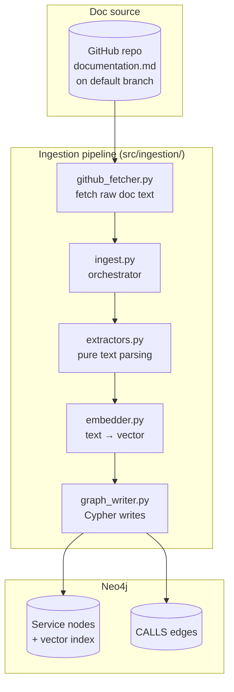
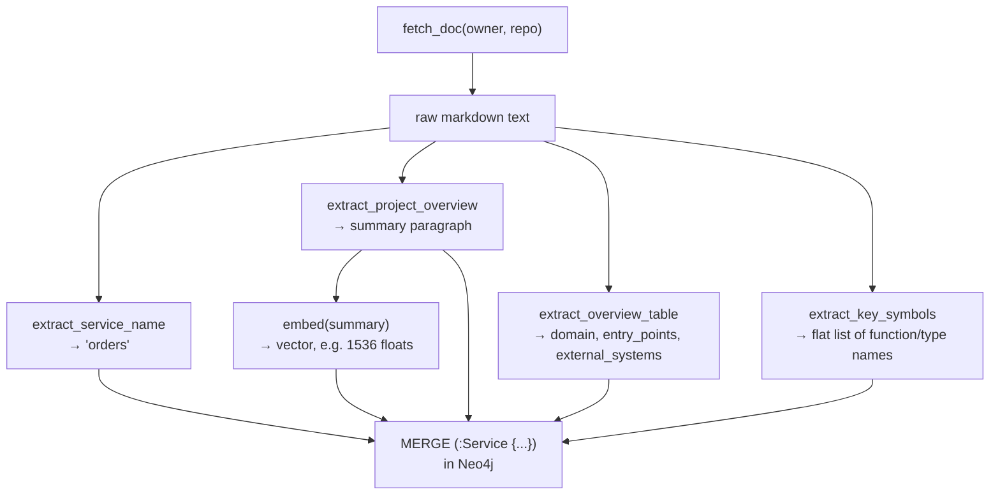
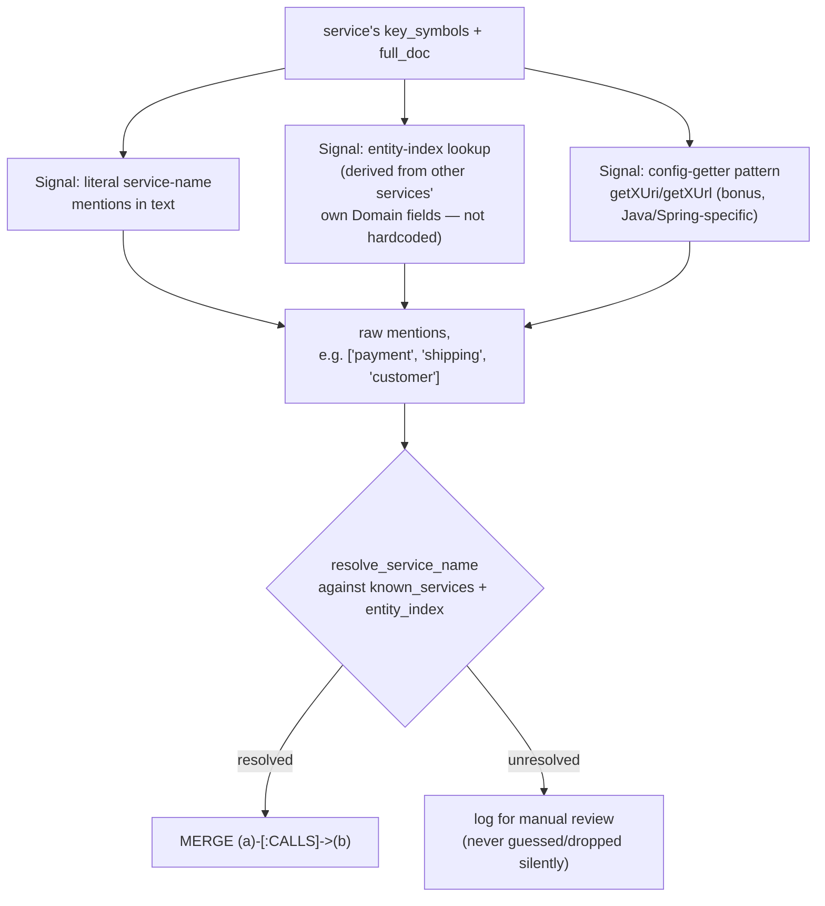
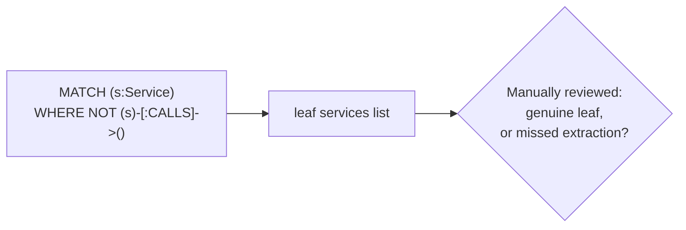
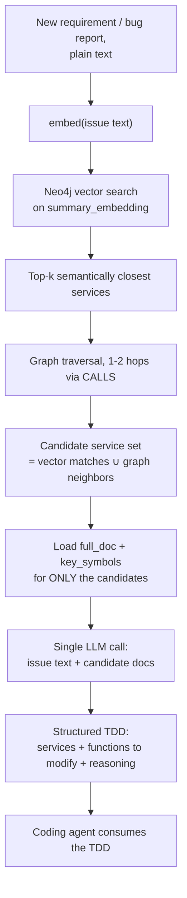

# Ingestion Pipeline

How service documentation (`documentation.md`, generated by RepoDocAI, one per
service repo) gets turned into a queryable graph in Neo4j — the graph the
planning agent later searches to figure out which services/functions are
relevant to a new requirement or bug report.

## Why a graph at all

The planning agent can't read all 40-50 services' full docs on every request —
that blows the context window and degrades reasoning even when it technically
fits. So ingestion happens **once, ahead of time**: each service's doc is
turned into a small graph node (searchable by meaning) plus edges to the
services it depends on. At query time, only a handful of *relevant* nodes'
full docs get loaded into the final planning call — the graph's job is purely
to narrow the candidate set cheaply.

---

## High-level architecture

No `.md` file is ever written to disk in this flow — the doc text passes
through memory from the GitHub API response straight to extraction, embedding,
and the database write.

---

## Stage 1 — Building a node (per service, no cross-service knowledge needed)

Every field here is a **direct extraction** from one part of the doc's
structure — no ambiguity, no resolution against other services. That's what
makes node-building the easy half of ingestion.

| Field | Source in the doc |
|---|---|
| `name` | `` Generated from `org/repo` `` line |
| `summary` (embedded) | Paragraph under `## Project Overview` |
| `domain`, `entry_points`, `external_systems` | Key-value table under that paragraph |
| `key_symbols` | "Key symbols" column, every row, File Reference table |
| `full_doc` | Entire raw text, stored as-is |
| `summary_embedding` | Computed, not extracted — one call to `embed()` |

---

## Stage 2 — Building edges (needs ALL nodes to exist first)

This only runs after every service's node is written, because resolving a
mention requires `MATCH`-ing an actual node by name.

**Why literal name-matching is the primary signal, not the getter pattern:**
`getPaymentUri`-style config getters are a Java/Spring idiom — they won't
appear in NestJS, GraphQL, or Kotlin services, so relying on that pattern as
the *main* signal would systematically under-detect edges for non-Java
services. Literal name/entity matching works regardless of language, since
it operates on the doc's prose and structured tables, not code syntax.

**Why the entity index replaces a hand-written alias dict:** a sentence like
*"calls to customer, address, card... services"* doesn't literally name a
real service — `customer`/`address`/`card` are entities the `user` service
owns. Instead of hardcoding `"customer": "user"`, that mapping is **derived
at ingestion time** from the `user` service's own doc (its Domain field says
"customer profile management"; its entity-like symbols include `Customer`,
`Address`, `Card`). Add a new service in any stack, and as long as its doc
describes what it owns, it plugs into the index automatically — no manual
edits.

This is implemented: `extract_owned_entities()` derives a service's owned
entities from its `key_symbols` (camel-case tokenized, filtered against an
action-prefix and a role-suffix denylist, then cross-checked against the
service's own Domain/overview text when one exists), and
`build_entity_index()` merges every service's claims into one
`{entity: owning_service}` map, dropping any entity claimed by more than one
service as ambiguous. `resolve_service_name()` tries, in order: exact match,
singular/plural normalization (e.g. `cart` -> `carts`, replacing what used
to be a hardcoded case), the entity index, then a `MANUAL_OVERRIDES` escape
hatch (empty by default, for the rare case genuinely not derivable from doc
text). The old `KNOWN_ALIASES` dict has been removed.

---

## Stage 3 — Sanity check

Run after every ingestion pass. A service showing up here should be a real
leaf (e.g. `user`/`shipping` in the Sock Shop sample — they don't call anyone
else). If a service you *know* calls others shows up here, extraction missed
something — investigate before trusting the graph.

---

## Query-time flow (what the graph is actually *for*)

The graph's only job is step C→F: cheaply narrowing 40-50 services down to a
handful worth actually reading in full. The LLM in step H still does the real
judgment call — the graph doesn't decide the plan, it decides what's worth
showing the model that decides the plan.

**This is implemented**, in `src/query/`:

| Flowchart step | Function |
|---|---|
| B — `embed(issue text)` | `src/ingestion/embedder.py::embed()` (reused as-is) |
| C/D — vector search | `src/query/graph_reader.py::vector_search_services()` |
| E — graph traversal | `src/query/graph_reader.py::expand_neighbors()` |
| F — candidate merge | `src/query/candidates.py::merge_candidates()` |
| G — doc loading | `src/query/graph_reader.py::load_candidate_docs()` |
| H — LLM call | `src/query/planner.py::call_llm()` |
| I — structured TDD | `src/query/planner.py::parse_tdd()` → `src/query/models.py::TechnicalDesignDoc` |
| J — entrypoint | `src/tools/query_tools.py::generate_technical_design()`, called from `src/query_agent/agent.py` |

Orchestrated end to end by `src/query/query_flow.py::build_tdd()`.

**The TDD schema** (`src/query/models.py::TechnicalDesignDoc`) is a proper
design document, not just a diagnosis: `title`, `issue_summary`, per-service
`changes` (each with a `file_path` — extracted from that service's own File
Reference table in its `full_doc`, never fabricated — plus a
`change_description` distinct from its `reasoning`), `risks`,
`testing_notes`, and `open_questions` for anything not determinable from the
docs alone. `src/query/render.py::render_markdown()` renders it as a
readable Markdown document; `generate_technical_design()` returns both the
structured data and the rendered Markdown so a coding agent can consume
either form.

**Traversal direction (step E):** both directions, 1-2 hops, not just
outgoing. `CALLS` means "A depends on B," but a bug's real fix can live in
either the callee (root cause) or a caller that depends on it (blast
radius) — a vector match alone doesn't tell you which. Since this step only
*widens* the candidate set (the LLM in step H does the actual filtering),
recall matters more than precision here, so both directions is the
deliberate default rather than an oversight.

---

## Credentials this pipeline needs

| Purpose | Env var(s) | Notes |
|---|---|---|
| Neo4j connection | `NEO4J_URI`, `NEO4J_USER`, `NEO4J_PASSWORD` | Required always |
| Embeddings | `OPENAI_API_KEY` **or** `AI_GATEWAY_URL`+`AGENTS_GATEWAY_KEY` | `embedder.py` auto-switches: gateway wins if both its vars are set, else falls back to OpenAI directly |
| Planning LLM call | Same as embeddings | `src/query/planner.py` uses the identical gateway/OpenAI fallback switch, just a chat call instead of an embed call |
| GitHub fetch | `GITHUB_TOKEN` | Optional — only needed for private repos or to raise the unauthenticated rate limit |

See `.env.example` for the full template.

---

## Known open items (not blockers, but worth revisiting as more real services are ingested)

- **Entity index quality**: `extract_owned_entities`'s `_ACTION_PREFIXES` /
  `_ROLE_SUFFIXES` denylists are a first-pass heuristic. When a service has
  no Project Overview text (the tech-stack-fallback-summary case, e.g.
  `flask`), the Domain/overview cross-check is skipped entirely and some
  noisy candidates may pass through symbol-shape filtering alone. Worth
  validating against a wider variety of real docs once available — it may
  need refining per naming convention.
- **Stack coverage of signals**: designed and tested only against Java/Spring
  Boot docs (the 3 Sock Shop samples) so far. Should be spot-checked against
  a NestJS/TypeScript or GraphQL service's doc once one is available, to
  confirm literal-name-matching and entity-index resolution hold up as the
  primary mechanism across stacks (by design they should, since they don't
  depend on code-naming conventions — but this is unverified against real
  non-Java docs).
- **`documentation.md` freshness**: ingestion trusts whatever's on the repo's
  default branch. If RepoDocAI regeneration and the push-to-GitHub step
  aren't both wired into CI yet, staleness has to be tracked manually.
- **Planning call JSON reliability**: `AiGatewayClient.chat()` has no
  `response_format`/JSON-mode parameter, unlike the OpenAI fallback (which
  requests `{"type": "json_object"}` natively). So on the gateway path,
  prompt-level discipline (the schema embedded in the system prompt) plus
  `planner.parse_tdd()`'s defensive parsing are the only reliability
  mechanism against malformed output — worth revisiting if the gateway
  client ever exposes a JSON-mode parameter.
- **`db.index.vector.queryNodes` deprecation**: Neo4j logs a deprecation
  warning for this procedure at query time (replaced by `SEARCH`). Still
  functionally correct as of this writing (verified against a live
  instance), but `graph_reader.vector_search_services()` should be migrated
  before the procedure is actually removed in a future Neo4j version.
